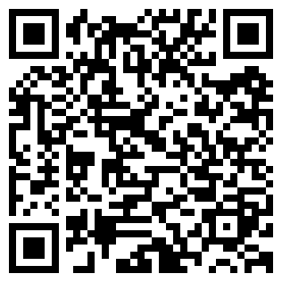

# DemoDog

2027870784@qq.com
[GitHub个人主页](https://github.com/2027870784)

## 教育背景

**东北大学秦皇岛分校** · 计算机科学与技术 · 本科  
2024.09 -- 至今

- 相关课程：数据结构、算法分析、线性代数、微积分、离散数学、C++程序设计
- 延伸学习：独立完成现代图形学入门课程 GAMES101，学习渲染管线理论与工程实现，具备较强的自驱力与图形学热情

## 核心技能

- 编程语言：掌握 **C++**
- 开发工具：能够使用 Git、Visual Studio Code、CMake
- 工程基础：掌握 STL 容器、内存管理、面向对象设计
- 图形学算法：**MVP 变换**、**重心坐标插值**、**深度测试**
- 着色模型：Lambert 漫反射、Blinn-Phong 光照模型
- 数学基础：**线性代数**（矩阵变换、向量运算）

## 项目经历

### 从零构建 C++ 3D 软光栅渲染器

*计算机图形学个人项目*

- 为深入理解图形渲染与游戏客户端图像绘制相关基础，在不依赖 OpenGL/DirectX 等高级图形 API 的前提下，独立使用 C++ 实现软件渲染器
- **实现几何阶段**：手写向量与矩阵运算库，完成模型坐标变换、空间位置计算等基础能力搭建
- **实现光栅化引擎**：基于**重心坐标插值**完成三角形填充算法，并通过 **深度测试**（Z-Buffer）解决像素遮挡问题，保证渲染结果正确
- **实现渲染管线核心流程**：完成 **MVP 变换**（Model -> World -> View -> Projection），并实现简易 Lambert 漫反射，构建基础光照计算流程
- **尝试性能优化**：使用 AABB 包围盒预筛减少无效三角形遍历，提升光栅化阶段处理效率
- **完成结果输出**：支持加载自定义模型并输出 `.ppm` 图像，形成从模型输入到像素生成的完整闭环
- **强化工程组织**：按几何、光栅化、管线流程进行模块拆分并开源至 GitHub，加深了对渲染管线各阶段协作关系的理解

[GitHub链接](https://github.com/2027870784/soft_render3d)

## 其他

- 方向：计算机图形学、C++
- 英语能力：通过英语六级，可独立阅读英文技术文档与图形学相关资料
- 技术兴趣：持续学习渲染管线、图形学基础、数学计算与 C++ 工程实现
